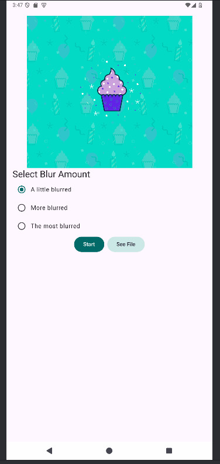
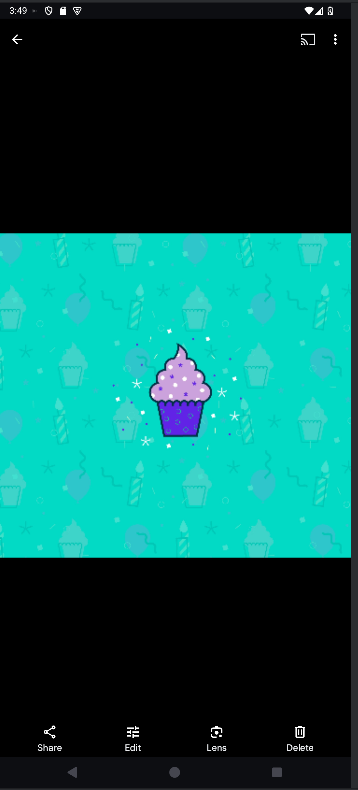

# 📷 **Bluromatic**

**Bluromatic** is a modern Android application that applies a blur effect to an image in the background using WorkManager. It demonstrates a clean architecture using MVVM, background processing with CoroutineWorker, and a beautiful Jetpack Compose UI. The image is saved to the device and notifications inform the user of progress.

## ✅ **LAST MAJOR UPDATES**

🔄 Enhanced UI State Management:
   - Integration of StateFlow in BlurViewModel to observe WorkManager state in real time.
   - Use of stateIn() to make the flow lifecycle-aware and Compose-compatible.
   -  Dynamic update of the interface according to state: default, in progress, completed.

🔗 Unique Work Chain with WorkManager:
   - Replacement of .beginWith() by .beginUniqueWork() with ExistingWorkPolicy.REPLACE.
   - Ensures only one job chain (cleanup → blur → save) is active at a time.

🧪 UI Task Control Improvements:
   - Added the ability to cancel an ongoing task via cancelUniqueWork().
   - Implemented a battery constraint: tasks only run if the battery is not low.
   - Added task tagging using .addTag(TAG_OUTPUT) to monitor specific tasks.
   - Final image result is now displayed in the UI with a "See File" button.

## ❌ **NEXT UPDATES**

   - Write UI tests for the worker sequence.

## 📋 **Features**

   - 🔮 **Blur Images** :

      - ✅ **DONE** Apply a blur effect in the background.
      - ✅ **DONE** Use WorkManager to run tasks off the UI thread.
      - ✅ **DONE** Chained tasks: cleanup -> blur -> save.
      - ✅ **DONE** Create unique task chains.
      - ✅ **DONE** Cancel tasks and manage states.
      - ✅ **DONE** Add constraints to tasks (e.g., network, charging).
   
   - 🎉 **Notifications** :

      - ✅ **DONE** Send Android notifications on start, success, and error.

   - 📷 **Image Management**

      - ✅ **DONE** Load a local image and apply blur.
      - ✅ **DONE** Save blurred image to MediaStore.
      - ✅ **DONE** Clean temporary images before blur.
      - ✅ **DONE** Display the final result (open image directly from the UI).

   - 🎨 Modern and Fluid Interface:

      - ✅ **DONE** Follows Material Design 3 guidelines.
      - ✅ **DONE** Responsive layout with adaptive UI.

      - Light/Dark Mode:
         - ✅ **DONE** Supports **light/dark mode**.

   - 🔄 Real-time status management:

      - ✅ **DONE** Use of StateFlow for UI state handling.
      - ✅ **DONE** ViewModel for lifecycle-aware logic.
      - ✅ **DONE** Coroutines for async data operations.
      - ✅ **DONE** Update UI dynamically with task tags and states.

   - 🧠 Architecture & Code Structure:

      - ✅ **DONE** MVVM architecture pattern.
      - ✅ **DONE** Clean separation between UI and business logic.
      - ❌ **UNDONE** Write UI tests for worker chains.

## 🛠️ **Tech Stack**

   - **Kotlin**: Modern, concise language for Android development.
   - **Jetpack Compose**: Declarative UI toolkit for Android.
   - **Material 3**: Modern, accessible user interface.
   - **StateFlow**: Reactive state management for real-time updates.
   - **ViewModel**: MVVM architecture to separate business logic from user interface.
   - **State Management**: Handle states with MutableStateOf and StateFlow.
   - **WorkManager**: Robust background task scheduling.
   - **CoroutineWorker**: Async task processing.
   - **MediaStore**: Save image to system gallery.
   
## 🚀 **How to Use**
1. **Launch the app**:
   - Download the "app-release.apk" file find in \app\release\ .
   - Install the file in your smartphone or in an emulator. (Good performance because in Release Build Variant)
   - If you want to use android studio, download the code and launch the app on an Android device or emulator. (Bad performance because in Debug Build Variant)
2. **Start a Blur:**:
   - Tap the "Start" button to apply a fixed blur (you can also cancel the task).
   - A notification appears when the task starts.
   - the blur task will not work if you have a low battery.
3. **Blur in Progress:**:
   - WorkManager executes background blur + save steps.
4. **Image Saved**:
   - Image is saved to your gallery.
   - You get a notification of the saved image.
5. **See your file**:
   - You get a notification of the saved image.
   - Image is saved to your gallery.
   - You can also see your saved file directly from the app by clicking on the "see file" button.

## 📸 **Screenshots**

- **Initial screen**:

   

- **Initial screen with file saved**:

   

- **Cleaing notif screen**:

   

- **Blur image notif screen**:

   

- **Save image notif screen**:

   

- **File saved screen**:

   

## 🤝 **Contributions**
Contributions are welcome! Feel free to fork the repository and submit a pull request for new features or bug fixes✅🟩❌.